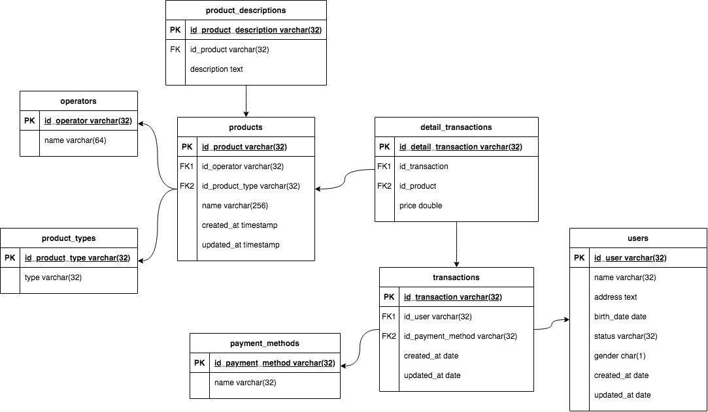

# Tugas Desain ERD dan Implementasi Database

### ERD:


### Query:
**Soal: Create database alta_online_shop.**
```
CREATE DATABASE alta_online_shop;
```

**Soal:  Implementasikanlah ERD menjadi table pada MySQL**
```
-- create table users
CREATE TABLE users (
	id_user varchar(32) PRIMARY KEY,
  name varchar(32),
  address text,
  description text,
  birth_date date,
  status varchar(32),
  gender char(1),
  created_at timestamp DEFAULT CURRENT_TIMESTAMP,
  updated_at timestamp DEFAULT CURRENT_TIMESTAMP ON UPDATE CURRENT_TIMESTAMP
);

-- create table operators
CREATE TABLE operators (
	id_operator varchar(32) PRIMARY KEY,
  name varchar(64)
);

-- create table product_types
CREATE TABLE product_types (
	id_product_type varchar(32) PRIMARY KEY,
  type varchar(32)
);

-- create table products
CREATE TABLE products (
	id_product varchar(32) PRIMARY KEY,
  id_operator varchar(32),
  id_product_type varchar(32),
  name varchar(256),
  created_at timestamp DEFAULT CURRENT_TIMESTAMP,
  updated_at timestamp DEFAULT CURRENT_TIMESTAMP ON UPDATE CURRENT_TIMESTAMP,
  
  CONSTRAINT fk_products_operators FOREIGN KEY (id_operator) REFERENCES operators (id_operator),
  CONSTRAINT fk_products_product_types FOREIGN KEY (id_product_type) REFERENCES product_types (id_product_type)
);

-- create table product_descriptions
CREATE TABLE product_descriptions (
	id_product_description varchar(32) PRIMARY KEY,
  id_product varchar(32),
  description varchar(32),
  
  CONSTRAINT fk_product_descriptions_products FOREIGN KEY (id_product) REFERENCES products (id_product)
);

-- create table payment_methods
CREATE TABLE payment_methods (
	id_payment_method varchar(32) PRIMARY KEY,
  name varchar(32)
);

-- create table transactions
CREATE TABLE transactions (
	id_transaction varchar(32) PRIMARY KEY,
	id_user varchar(32),
  id_payment_method varchar(32),
  created_at timestamp DEFAULT CURRENT_TIMESTAMP,
  updated_at timestamp DEFAULT CURRENT_TIMESTAMP ON UPDATE CURRENT_TIMESTAMP,
  
  CONSTRAINT fk_transactions_users FOREIGN KEY (id_user) REFERENCES users (id_user),
  CONSTRAINT fk_transactions_payment_methods FOREIGN KEY (id_payment_method) REFERENCES payment_methods (id_payment_method)
);

-- create table detail_transactions
CREATE TABLE detail_transactions (
	id_detail_transaction varchar(32) PRIMARY KEY,
	id_transaction varchar(32),
  id_product varchar(32),
  price double,
  
  CONSTRAINT fk_detail_transactions_transactions FOREIGN KEY (id_transaction) REFERENCES transactions (id_transaction),
  CONSTRAINT fk_detail_transactions_products FOREIGN KEY (id_product) REFERENCES products (id_product)
);
```

**Soal: Create tabel kurir dengan field id, name, created_at, updated_at.**
```
CREATE TABLE kurir (
	id varchar(32) PRIMARY KEY,
	name varchar(32),
  created_at timestamp DEFAULT CURRENT_TIMESTAMP,
  updated_at timestamp DEFAULT CURRENT_TIMESTAMP ON UPDATE CURRENT_TIMESTAMP
);
```

**Soal: Tambahkan ongkos_dasar column di tabel kurir.**
```
ALTER TABLE kurir ADD ongkos_dasar double;
```

**Soal: Rename tabel kurir menjadi shipping.**
```
ALTER TABLE kurir RENAME TO shipping;
```

**Soal: Hapus / Drop tabel shipping karena ternyata tidak dibutuhkan.**
```
DROP TABLE shipping;
```

**Soal: Silahkan menambahkan entity baru dengan relation 1-to-1, 1-to-many, many-to-many. Seperti:**
```
-- 1-to-1: payment method description.
CREATE TABLE descriptions (
	id_descriptions varchar(32) PRIMARY KEY,
  id_payment_method varchar(32),
  description varchar(32),
  
  CONSTRAINT fk_descriptions_payment_methods FOREIGN KEY (id_payment_method) REFERENCES payment_methods (id_payment_method)
);

-- 1-to-many: user dengan alamat.
CREATE TABLE alamat (
	id_alamat varchar(32) PRIMARY KEY,
  id_user varchar(32),
  alamat text,
  
  CONSTRAINT fk_alamat_users FOREIGN KEY (id_user) REFERENCES users (id_user)
);

-- many-to-many: user dengan payment method menjadi user_payment_method_detail.
CREATE TABLE user_payment_method_detail (
	id_user_payment_method_detail varchar(32) PRIMARY KEY,
  id_user varchar(32),
  id_payment_method varchar(32) ,
  
  CONSTRAINT fk_user_payment_method_detail_users FOREIGN KEY (id_user) REFERENCES users (id_user),
  CONSTRAINT fk_user_payment_method_detail_payment_methods FOREIGN KEY (id_payment_method) REFERENCES payment_methods (id_payment_method)
);
```